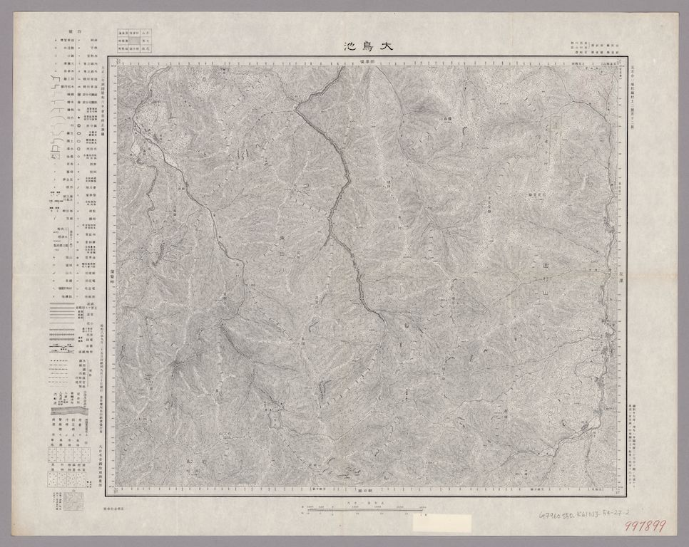
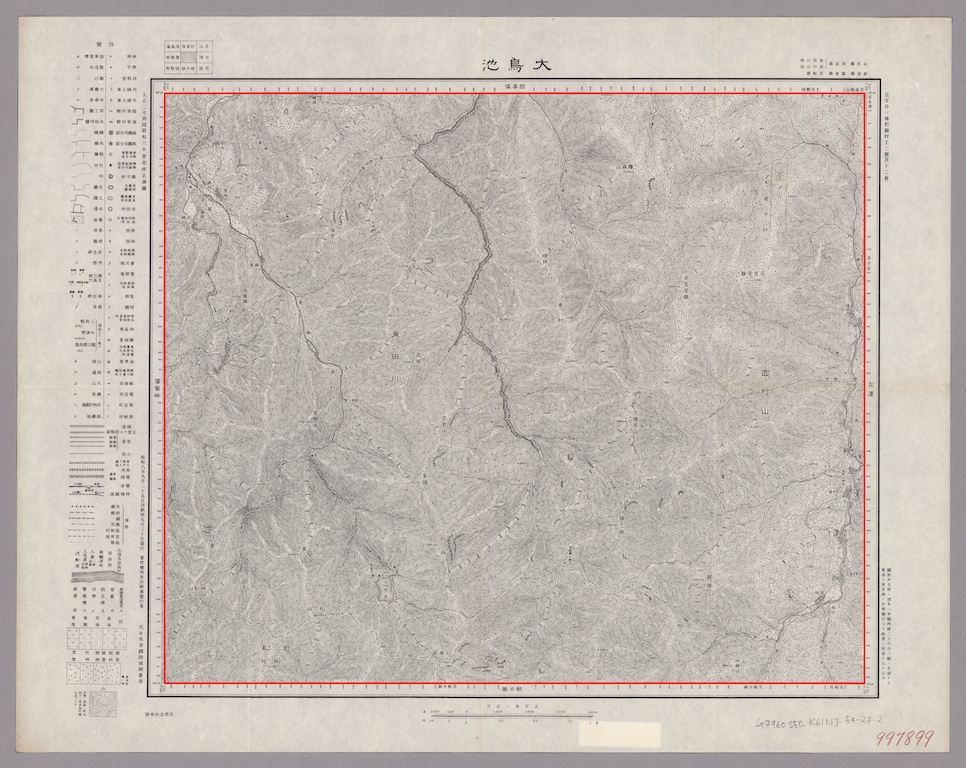

# Map Image Frame Detection

Detect map frames of Gaihozu(外邦図) series.

## Input



## Output



## Isnstall

For Mac

```shell
$ brew install opencv numpy
$ git clone git@github.com:kamataryo/get-corners.git
$ cd get-corner
```

## Usage

The command below returns pixel coordinates of 4 corners in format of Python Array string, `[[x1, y1], [x2, y1], [x1, y2], [x2, y2]]`.

```shell
$ python3 ./main.py ./example.jpg
```
